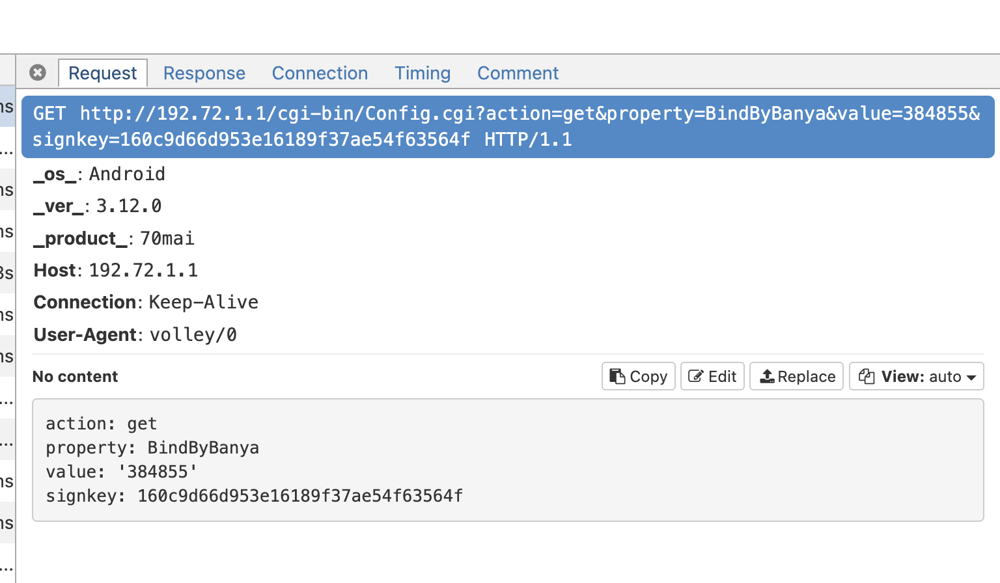
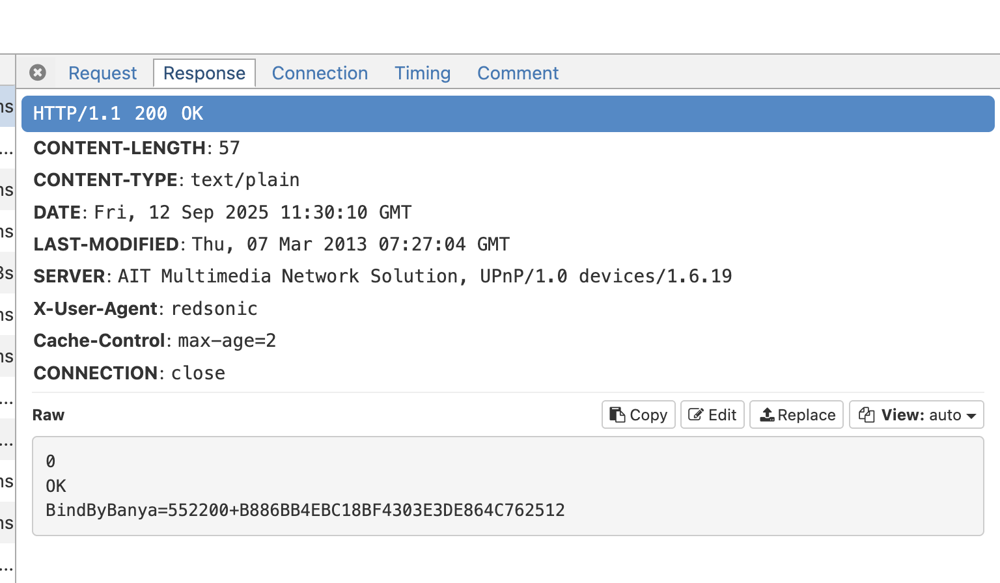

import Caption from "../../../../components/TypographyExtras/Caption"
import Box from "@mui/material/Box"

## Exploring the 70mai M200 Dashcam API

<Box style={{ display: "flex", justifyContent: "center" }}>
  <div style={{ maxHeight: "400px", overflow: "hidden" }}>
    
  </div>
</Box>

I’ve been curious about how the 70mai M200 communicates with its Android app, and whether it’s possible to access the API directly.  
This exploration was less about writing a guide, and more about understanding what’s going on under the hood. My motivation here was to
use some linux sbc and schedule the backup. which we will explore in upcoming posts.

Quick google search for 70mai API access gets [Reverse engineering the 70mai app](https://alu.dog/posts/reverse-engineering-the-70mai-android-app). This was the foundation
for my exploration.

At [Reverse engineering the 70mai app](https://alu.dog/posts/reverse-engineering-the-70mai-android-app), I learned that the 70mai app is signed with a custom key generated by
the dashcam on initial setup. But this wasnt working for me, could be because my dashcam was updated or it was a different product(M200 vs A500S).


[70maiM300Toolbox](https://github.com/XuZhen86/70maiM300Toolbox) was another find, that allowed me to understand more about how signing worked, but i wasnt able to directly use this
since it was built for M300.

---

### MITM Traffic Analysis

To see the app in action, I routed the Android device traffic through a MITM proxy on my Mac. Observing the requests was fascinating:

- Each request included `action`, `property`, `timestamp`, and `signkey`.  
- The initial pairing returned a **token**, which is critical for signing requests:

```text
0
OK
BindByBanya=552200+B886BB4EBC18BF4303E3DE864C762512
```





Here i realized `B886BB4EBC18BF4303E3DE864C762512` was the key i was looking for, now the usage part.


---

### Decompiling the App

I started by decompiling the APK using [jadx](https://github.com/skylot/jadx).  
I was looking for anything related to `signkey`, since it seemed central to authenticating requests.  

Browsing the code, I found that the signkey is generated from a combination of **URL parameters and a secret token** — what the app refers to as the *banya key*. The hashing logic itself was simple MD5, but understanding the exact parameter order was key.


```java
private static URL a(Context context, String str, String str2, C0455a[] c0455aArr) {
        try {
            String strD1 = d1(context);
            if (strD1 == null) {
                return null;
            }
            StringBuilder sb = new StringBuilder();
            StringBuilder sb2 = new StringBuilder();
            if (TextUtils.isEmpty(MainActivity.V1)) {
                sb.append("action=" + str2);
                sb2.append(b.S7 + strD1 + str + "?action=" + str2);
            } else if (f21059f.equals(str2)) {
                sb.append("action=" + f21065h);
                sb2.append(b.S7 + strD1 + str + "?action=" + f21065h);
            } else if (f21062g.equals(str2)) {
                sb.append("action=" + f21068i);
                sb2.append(b.S7 + strD1 + str + "?action=" + f21068i);
            } else {
                sb.append("action=" + str2);
                sb2.append(b.S7 + strD1 + str + "?action=" + str2);
            }
            for (C0455a c0455a : c0455aArr) {
                if (c0455a != null) {
                    sb2.append("&");
                    sb2.append(c0455a.a());
                    sb.append("&");
                    sb.append(c0455a.b());
                }
            }
            long jCurrentTimeMillis = System.currentTimeMillis();
            sb.append("&timestamp=");
            sb.append(jCurrentTimeMillis);
            sb2.append("&timestamp=");
            sb2.append(jCurrentTimeMillis);
            String strG1 = g1(sb.toString());
            if (strG1 == null) {
                return new URL(sb2.toString());
            }
            return new URL(sb2.toString() + "&signkey=" + strG1);
        } catch (MalformedURLException e9) {
            e9.printStackTrace();
            return null;
        }
    }
```

this was the function that made me understand how signkey works.

---

### Reproducing the Signkey

With the token and the request string format figured out, generating the signkey in Python was straightforward:

```py
import hashlib
import time

token = "B886BB4EBC18BF4303E3DE864C762512"
timestamp = int(time.time() * 1000)
params = f"action=BY1&property=Camera.Preview.MJPEG.status.*&timestamp={timestamp}"
signkey = hashlib.md5((params + token).encode()).hexdigest()

print("Signkey:", signkey)

print(f"Final URL: 'http://192.72.1.1/cgi-bin/Config.cgi?{params}&signkey={signkey}'")
```
<br/>
Contrary to the below description, the M200 computes `signkey = md5(<query-params-and-timestamp> + <token>)`. The protocol, hostname and full URL path are excluded from the hashed input.

```6. Now you can make requests to the camera by adding a signkey to the URL. The signkey is calculated as md5(<requestUrlWithParamsAndTimestamp> + <token>)```([Capturing the pairing handshake](https://alu.dog/posts/reverse-engineering-the-70mai-android-app/#capturing-the-pairing-handshake))

<br/>

Seeing the computed signkey match the one sent by the app was a satisfying “aha” moment — it confirmed that the signing mechanism was fully understood.

---

### Reflections

What struck me most during this exploration:
* The banya key is unique per device and generated at pairing.
* The signing algorithm is simple, yet robust enough for local API authentication.
* By combining decompilation, MITM, and a bit of Python, the API becomes accessible.

This sets the stage for automating backups and integrating the dashcam with other systems — something I plan to dive into in upcoming posts.

<Caption>These findings are from my personal exploration and experimentation.</Caption>
